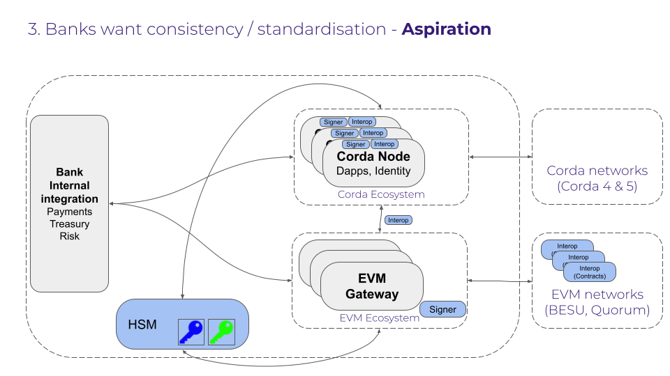

# Bank Side patterns

## Introduction 
Banks are looking for consistency and standardisation when it comes to connecting to different digital platforms and managing interoperability between different settlement legs.

At a simplistic level, banks will be running gateways to different platforms.  These gateways could be using different technologies.  Below is an image showing the generic components that banks will need to manage.  The image is showing a corda gateway and an enterprise ethereum gateway, but this pattern can be extended to other technology stacks.

## Risk as platforms scale 
The risk to banks as the platforms scale is that they need to manage a plethora of gateways, interfaces, data formats and interop mechanisms.  By establishing some standard patterns, we can provide guardrails to platorm providers to ensure that the connections to their platforms and the interop mechanisms are well understood by the banks and easy to deploy,

## Aspiration 
The Aspiration of Harmonia is to provide those guardrails in order to be able to generate common/open source interfaces and protocols across apps and DLT protocols

## Interfaces 
There are in fact only 4 interfaces to consider.  By focusing on these 4 interfaces the ecosystem of banks and platforms have a real opportunity to establish a simple and standard way for different components to communicate with eachother.  The 4 interfaces are:

 - The HSM interface (already largely standardised to use PKCS#11)
 - The Bank Side API
 - The Interop interface
 - The Network interface (well documented across the major DLT protocols)

 

