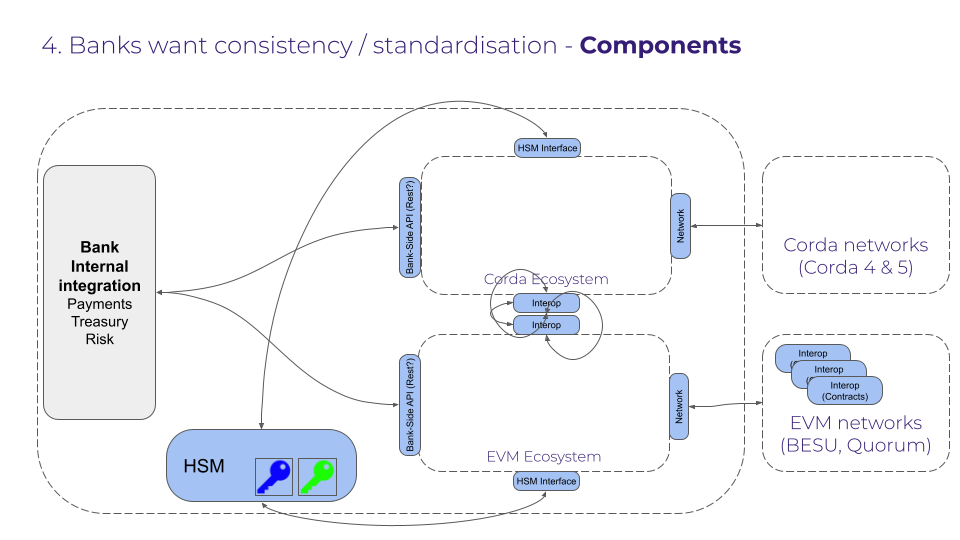

# Bank Side patterns

## Introduction 

Banks are looking for consistency and standardisation when it comes to connecting to different digital platforms and managing interoperability between different settlement legs.

At a simplistic level, banks will be running gateways to different platforms.  These gateways could be using different technologies.  Below is an image showing the generic components that banks will need to manage.  The image is showing a corda gateway and an enterprise ethereum gateway, but this pattern can be extended to other technology stacks.

## Risk as platforms scale

As the platforms scale, banks will need to manage multiple gateways, interfaces, data formats and interop mechanisms.  By establishing some standard patterns, we can provide guardrails to platform providers to ensure that the connections to their platforms, and the interop mechanisms involved, are well understood by the banks and easy to deploy.

## Aspiration

Harmonia aspires to provide those guardrails in order to be able to generate common/open source interfaces and protocols across apps and DLT protocols.

## Interfaces 

The interfaces to consider depends on the ecosystem of banks, but consists mainly of the following 4:

 - The HSM interface (already largely standardised to use PKCS#11)
 - The Bank Side API
 - The Interop interface
 - The Network interface (well documented across the major DLT protocols)

 

