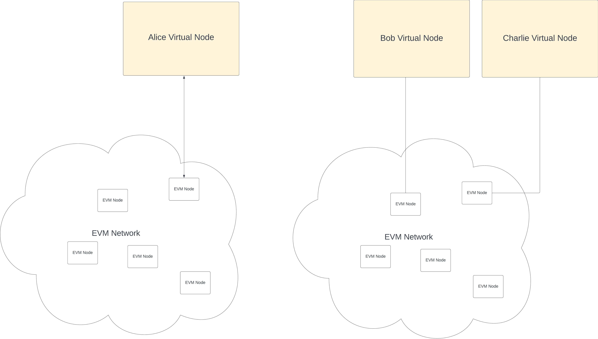
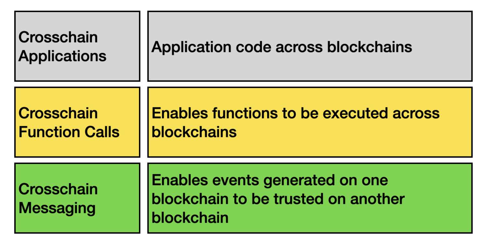
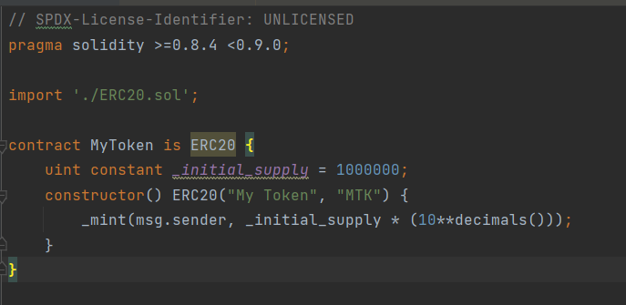
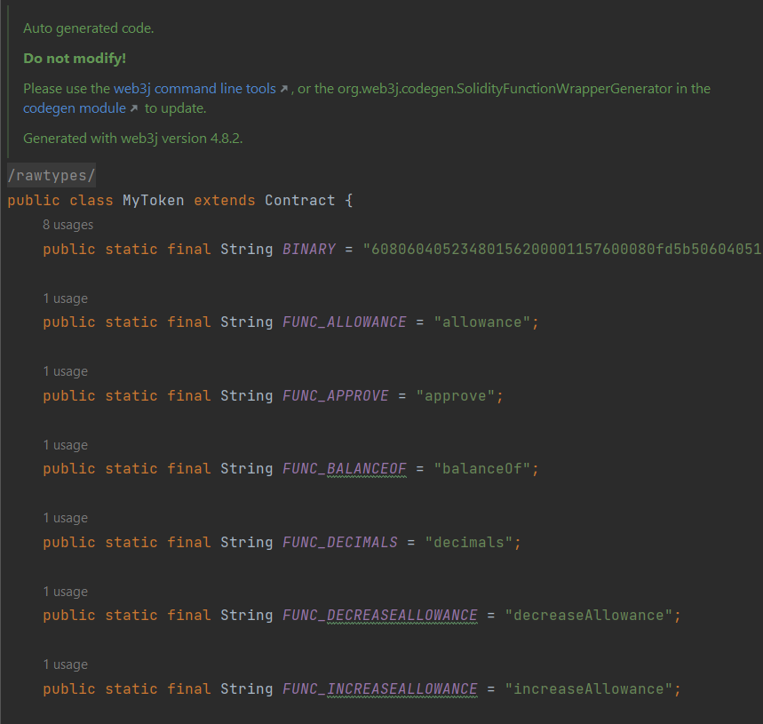
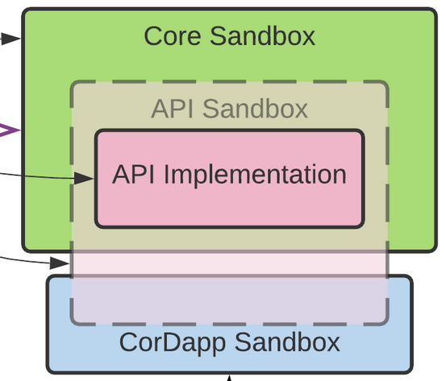
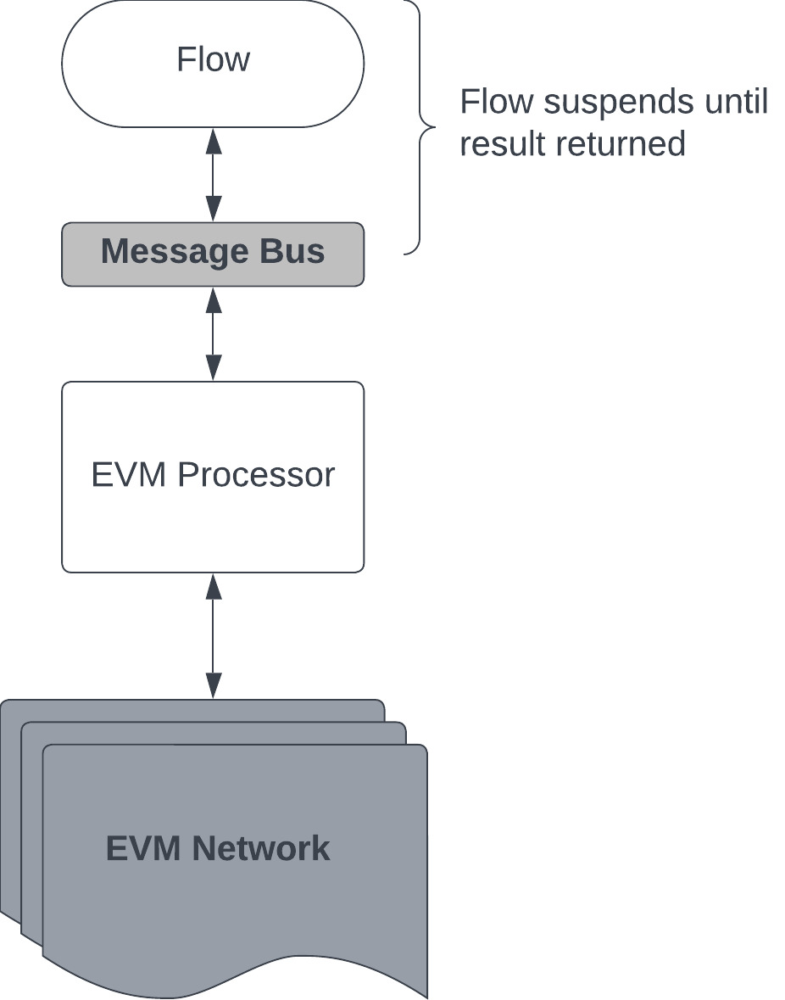
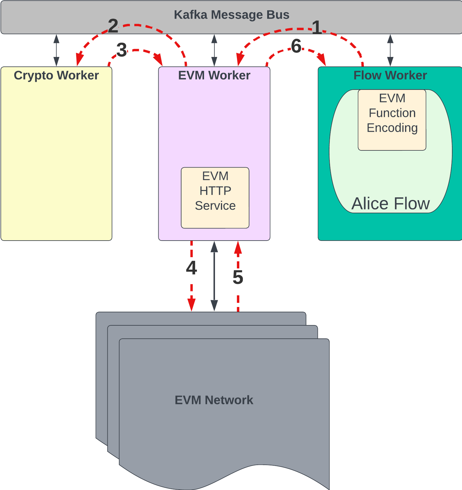

# Table of Contents

<!-- ts -->
* [Corda 5 – EVM Interoperability](#corda-5--evm-interoperability)
    * [Agenda - What are we going to cover?](#agenda---what-are-we-going-to-cover)
    * [Scene setting - Why are we here?](#scene-setting---why-are-we-here)
    * [Work to date – what’s in the wild?](#work-to-date--whats-in-the-wild)
    * [The industry demands standards](#the-industry-demands-standards)
    * [A layered solution –  Enterprise Ethereum Alliance standard](#a-layered-solution---enterprise-ethereum-alliance-standard)
    * [A layered solution – Splitting the problem](#a-layered-solution--splitting-the-problem)
* [Platform Layer](#platform-layer)
* [Outbound Communication](#outbound-communication)
    * [How to use Web3?](#how-to-use-web3)
    * [Web3j in a flow?!](#web3j-in-a-flow)
    * [Solution(a) Make Web3j work for us](#solutiona-make-web3j-work-for-us)
    * [Solution(b) Encode the Web3 functions ourselves](#solutionb-encode-the-web3-functions-ourselves)
    * [Recap - A basic primer on the architecture of Corda 5](#recap---a-basic-primer-on-the-architecture-of-corda-5)
    * [How do we communicate with an EVM from a flow?](#how-do-we-communicate-with-an-evm-from-a-flow)
    * [External Events](#external-events)
    * [What do we do when Corda Identity is not the same as an Ethereum wallet address?](#what-do-we-do-when-corda-identity-is-not-the-same-as-an-ethereum-wallet-address)
    * [Transactions need to be signed](#transactions-need-to-be-signed)
    * [When does a flow resume from a call?](#when-does-a-flow-resume-from-a-call)
    * [Summary – From Flow to EVM (and back again)](#summary--from-flow-to-evm-and-back-again)
* [Inbound Communication](#inbound-communication)
    * [What about events that originate on an EVM?](#what-about-events-that-originate-on-an-evm)
* [High Availability](#high-availability)
    * [What about Corda 5 and HA?](#what-about-corda-5-and-ha)
    * [Scaling out for multiple EVM Workers](#scaling-out-for-multiple-evm-workers)
* [User Experience](#user-experience)
    * [Does this look right?](#does-this-look-right)
* [Platform Layer - Architecture](#platform-layer---architecture)
* [Protocol Layer](#protocol-layer)
    * [Platform isn’t protocol](#platform-isnt-protocol)
    * [What if we want to apply a C5-C5 protocol to C5-EVM?](#what-if-we-want-to-apply-a-c5-c5-protocol-to-c5-evm)
        * [Façades](#façades)
* [Summary](#summary)
<!-- end -->

<!-- body-start -->

# Corda 5 – EVM Interoperability

This document aims to address the Corda 5 to Ethereum architecture and what will be done to enable interoperability between the two platforms.

## Agenda - What are we going to cover?

- How we got here
- What others have done
- Why we are doing it
- Industry standard architecture
- How to work with Ethereum
- Using Web3j
- Web3 inside a sandbox
- Getting Web3 calls out of a sandbox
- Mapping Corda/Ethereum identities
- Getting Web3 results back into a sandbox
- Transaction signing for an EVM
- Detecting events from Ethereum
- Reliability
- Code Simplicity
- Defining protocols
- C5-C5 and C5-EVM alignment

## Scene setting - Why are we here?

Why are we looking to interop with Ethereum?
  * We are interested in pursuing an interoperability strategy based on  assets/currencies which will be issued and managed by many different networks running on a variety of DLT/blockchain platforms.
  * Providing the ability to operate cross-chain in this way will support complex value chains
  * NOTE: Many of our investors/customers want us to work with different flavours of EVM (public Ethereum and private Quorum, Besu etc networks)

* The primary use case for Corda 5 to work with private EVMs appears to be trustless (no intermediary) settlement

* The use case for Corda to work with public EVMs is primarily
  * trusted bridging to allow liquidity to move between networks e\.g\.\, attract liquidity on Ethereum\, manage it on Corda
  * swaps to enable customer networks to expand usage

## The goal
This picture shows our vision of Corda communicating with Ethereum.  Each [Virtual Node](https://docs.r3.com/en/platform/corda/5.0/key-concepts/cluster-admin/virtual-nodes.html) will interact with a specific EVM Node in a network.



## Work to date – what’s in the wild?

There are many different groups working on interoperability.  Below are a few.

  * __Enterprise Ethereum Alliance \(EEA\)__ - [EEA Crosschain Draft](https://entethalliance.github.io/crosschain-interoperability/draft_crosschain_techspec_messaging.html)
  * __Hyperledger__
    * __Cacti__ - (https://www.hyperledger.org/projects/cacti)
    * __YUI__ - https://labs.hyperledger.org/labs/yui.html
  * __Inter Blockchain Communication \(IBC\)__ 
    * __Cosmos__ - https://github.com/cosmos/ibc
    * __Cross Framework__ (https://datachainlab.github.io/cross-docs/)
  * __Ad Hoc bridges__

## The industry demands standards

We know that there is a need in the industry for chains to have the capability to work with each other.  We can look to other sources for inspiration on how we would want our solution to look.

## A layered solution –  Enterprise Ethereum Alliance standard



How would this look in Corda?

## A layered solution – Splitting the problem

| Application Layer | - Specifics can be handled off-chain/off-ledger<br />- Interop use case attributes are provided to the Protocol Layer via REST as flow parameters<br />- CorDapp code includes asset model (states and contracts) and flows which manage the asset in the Corda network; may also include code used to generate transactions for specific EVM smart contracts<br /> |
| :-: | - |
| Protocol Layer | Algorithms for interop (PvP, DvP, Burn&Mint, Escrow&Mint)<br/> - locking, establishing trust, event validation<br />- Protocol should be pluggable<br/> - Corda could support EEA standard or IBC<br />- Implemented as Cpk of useful flows |
| Platform Layer | Corda 5 basic integration with the EVM with additional capabilities such as<br/>- high-availability<br/>- sandboxing |

To make the information in the above table ever more terse, the `Application Layer` deals with User Business Logic (non-Corda), the `Protocol Layer` is a specific set of flows which allow for certain on-chain operations to take place, and the `Platform Layer` is how Corda technically delivers EVM interaction.

# Platform Layer

Problem: So\, you want to interact with Ethereum…  How?\!

Solution: Web3 standard

  * [https://ethereum\.org/en/developers/docs/apis/json\-rpc/](https://ethereum.org/en/developers/docs/apis/json-rpc/)

  * [https://github\.com/ethereum/execution\-apis/tree/main](https://github.com/ethereum/execution-apis/tree/main)

# Outbound Communication

## How to use Web3?

What mechanisms are in place to allow us to use Web3 in Corda?

* __Web3j__  – is an industry standard library approach that gives us:
  * The ability to transform Solidity contracts to Java
  * A mechanism for transmitting that information to an EVM network
  * Well maintained \(and Apache 2\.0\)
  * Already used by R3 \(in demos\)




## Web3j in a flow?!

This makes the code, from within the flow the same as what would be used by any java developer.


```
private val web3j: Web3j

val contract = ERC20\.load\(address\, web3j\, …\)

val balance = contract\.balanceOf\(…\)
```

But…

It’s not `OSGi` compliant (so we can’t use in a sandbox).  Also it tends to prefer direct access to a chain (e.g., via HTTP).  And then there are transitive dependencies…

## Solution(a) Make Web3j work for us

  * We _can_ make it work with `OSGi`
  * We _can_ get around the HTTP connection by injecting a proxy for communication (Web3j is designed specifically to allow this)
  * We can manage the dependencies

The problem is that all of this could be difficult to maintain.

## Solution(b) Encode the Web3 functions ourselves

A compiled smart contract will provide a `json` representation of the smart contract functions called the ABI ([Application Binary Interface](https://docs.soliditylang.org/en/latest/abi-spec.html#)), e.g.:

```
"abi": [
  {
    "inputs": [
      {
        "internalType": "address",
        "name": "newOwner",
        "type": "address"
      }
    ],
    "name": "changeOwner",
    "outputs": [],
    "stateMutability": "nonpayable",
    "type": "function"
  },
  {
    "inputs": [],
    "name": "getOwner",
    "outputs": [
      {
        "internalType": "address",
        "name": "",
        "type": "address"
      }
    ],
    "stateMutability": "view",
    "type": "function"
  }
]
```

* We can do the same as Web3j and encode the Web3 function ourselves.
  * Structure for functions can be read from compiled solidity code
  * Removes the need for `OSGi`
  * No new dependencies

## Recap - A basic primer on the architecture of Corda 5

Before we continue it's worth revisiting the architecture of Corda 5.  Corda 5 operates as a cluster or [workers](https://docs.r3.com/en/platform/corda/5.0/key-concepts/cluster-admin/workers.html), each of which may contain one or more `processors`.  

The workers are the runtime services, while the processors are what do the work.  It is possible, and even likely, that we will have multiple workers running at a time, allowing for some parallelism of the processors, giving us the ability to execute multiple instructions (in our case, EVM commands) at the same time.

## How do we communicate with an EVM from a flow?

Now that we have a structure for encoding our functions, how do we send our encoded function out to the EVM?



Well… we can’t.  We’re sandboxed.  In Corda 5, all flows are isolated from the outside world and access is restricted.  This is a security measure and one we certainly want to keep.

Luckily, Corda 5 has a mechanism for getting operations done outside of a flow.


## External Events

In Corda 5, the mechanism for sending a message outside of the flow is called `External Events`.  This mechanism suspends the flow and sends the message out to the message bus.  It can then be picked up by a separate (non-sandboxed) processor which can convert it to a command to send to the EVM network.

That processor will then return any response via the bus back to the flow, which will then resume.




## What do we do when Corda Identity is not the same as an Ethereum wallet address?

Corda and Ethereum have different concepts of what it means to have an "identity".  In Corda, the identity is bound to a _real world entity_, whereas, in Ethereum, it's a wallet address (so, not really an identity at all)

What do we do when Corda’s  __Alice__  identity isn’t an exact match for her Ethereum wallet address?

|  |  |
|---|---|
| Corda Identity: | <span style="color:#6A8759">“O = Alice, L = London, C = GB"</span> | |  |  |  |
| Wallet Address: | <span style="color:#0070C0">0x02643ed6819E63d022434b5a6de6E01C73Efe571</span> |  |  |  |


We can use the Alias mappings from C5-C5 Interop to go from a Corda Identity -> Ethereum wallet address.

| | |
| :-: | :- |
| Interop Alias | An Interop alias is an alias or label assigned to an ego/alter ego to be used in an Interop group.|


## Transactions need to be signed

Ethereum requires us to signing a transaction before submitting it.  And we'll need to sign with a key that is known by the EVM as one belonging to a specific wallet.  

Unfortunately, the current Crypto Worker doesn’t support external (to itself) private keys.  


We will need to add to the Crypto Worker the operations we need:
* Customer needed operations:
  * Signing using existing keys
    * Bring your own keys (BYOK)
    * allowing us to import keys that are already known by the EVM
  * External Signing services
    * allowing us to have a transaction signed by some external service (e.g. HSM, or cloud provider)


## When does a flow resume from a call?

On Ethereum there are, broadly, two types of calls we can make:
  * Queries – where a result is returned immediately
  * Transactions – which are signed instructions to perform some action on the underlying EVM network. These instructions may or may not be valid, and may or may not be executed and confirmed in any given timescale, so an ID (transaction hash) is returned, which can be queried to determine the result.

For queries we will simply return the result immediately back to the flow.

For transactions we have several options to explore:
* we can return the transaction hash immediately back to the flow
* we can store the hash for the flow to query the transaction state
* we can keep the flow suspended until a transaction block has been committed, then return
* we can return the hash and allow the user to set a flow to be triggered once the transaction has been committed.

All of these use cases will be explored to determine which would be useful.

## Summary – From Flow to EVM (and back again)

The following is one use case for a flow to send commands to an EVM
  * Encode the message using our Web3 encoding library
  * Send via external event to the EVM Processor
  * Map identities from Corda to Ethereum
  * Sign the transaction
  * Return any results (waking up the flow) 
    * We can return immediately with a transaction hash
    * We can return once a transaction has been committed
    * We can return the hash immediately and subscribe to detect the transaction to be committed and then trigger another flow to follow on


# Inbound Communication

## What about events that originate on an EVM?

What if a change to the chain should trigger a flow in response?  We don't want to design a "Corda first" approach that locks people into a single way of implementing their logic.

We should expect that solutions will be desired such that an event on Ethereum would cause Corda to react and trigger a flow


There is a Web3 standard to subscribe for events to a chain, e.g., by listening for the new blocks on the chain.

We will use that functionality to subscribe to events and then can map that back to some trigger in Corda, possibly starting a flow, or resuming a suspended flow.

# High Availability

## What about Corda 5 and HA?

High Availability is a key tenet of Corda 5 and we'll ensure from the beginning that our C5-EVM interop solution includes the necessary components to handle failure scenarios.


We know that bridging chains can be done externally.  There are tools that can handle the interop at a meta-level outside of either Corda or Ethereum.

But using other providers means:
  * The bridge component needs to be highly available itself
  * It may require a different tech stack to implement in addition to that required by Ethereum and Corda

By implementing the interop solution natively we can bring along a highly available bridge “for free” and reduce the admin burden of using another ecosystem

Our reliability will come from Corda itself.
  * Flow checkpointing means that we will have guarantees on continuity and a level of retry for when errors occur.
  * Corda 5 has some guaranteed message patterns that we can leverage in order to retain the state of any given execution on the EVM (query, transaction, or subscription)

## Scaling out for multiple EVM Workers

We will need to think carefully about how we expect to handle running multiple workers at a time in regards to retaining High Availability.

We'll want to ensure that any instructions sent from a flow can be handled by _any_ EVM worker.  In addition, any in flight requests by an EVM will need to be able to be picked up by another EVM should the first cease execution suddenly.

We have the capability in our message bus to handle these scenarios and we will design our messages and state model accordingly to cover this by keeping the state to a minimum and ensuring it contains exactly the information needed so that any EVM can continue to check for responses.

# User Experience

## Does this look right?

Up to this point we have a very dynamic, runtime-based solution.  It has a couple of less than ideal features:
  * ABI files read at startup
  * Runtime checking of function calls

It will work, but it doesn't lead to the best code we can provide.

For example the solidity contract here:

```
contract Storage {

  uint256 number;

  /**
   * @dev Store value in variable
   * @param num value to store
   */

  function store\(uint256 num\) public \{
    number = num;
  }

  /**
  * @dev Return value
  * @return value of 'number'
  */
  function retrieve\(\) public view returns \(uint256\)\{
    return number;
  }
}
```

Would look something like this in a flow:

```
val contract: SmartContract = EVMContract(smartContractCache.get(“Storage”))
contract.execute(“store“, 42)
```

As we progresss in the development of our interop solution, we can focus on making the smart contract classes easier to use, ideally by using Java's ASM bytecode manipulation or by providing some code-generation tools to define static classes based on a given ABI.  This is what `Web3j` also provides, but we'd build classes that can fit within a sandbox.

The result would look more like this:
```
val contract = Storage()
contract.store(42)
```

# Platform Layer - Architecture

This is the planned architecture for the C5-EVM interop on Corda.  In the following diagram we've placed the components needed for interop as well as the typical path through Corda 5.



# Protocol Layer
## Platform isn’t protocol

Now we can execute arbitray function calls on the EVM or smart contracts. But that doesn’t mean we can bridge chains or swap tokens.

Admittedly, there is still work to be done with our partners over this layer.  We are still determining what the protocols will look like and this is a primary reason for the `Harmonia Project` and the lessons we learn there will apply to the protocols developed.

We do expect to define a set of algorithms (implemented as flows) which can be useful for performing operations between networks
  * Atomic Swap
  * PvP
  * DvP
  * Burn & Mint
  * Escrow & Mint

These flows will be stored as a library of useful utilities that can be included by users developing applications.

## What if we want to apply a C5-C5 protocol to C5-EVM?

Let's examine the following use case: A user executes C5-C5 swaps via a command, but decides to do the same for C5-EVM, ideally with as little effort on their part to switch as possible. (and note that this would also be useful for the next blockchain/ledger we add)

### Façades
For that, we can introduce façades.  Currently in use by the C5-C5 interop, façades allow for an interface to by dynamically mapped to a runtime execution.  So we can bind the C5-EVM protocols to a given command instead of the C5-C5 ones.

Note that work is ongoing to determine the common interface between these different protocol models and what, for example, `PvP` means in each use case.  Again, our work with `Harmonia` will inform a lot of this discussion.

# Summary

In our layered approach to this interoperability piece we have focused on the `Platform Layer` and how we will technically deliver Corda 5 to Ethereum communication.  This has included encoding in a Web3 format, and navigating the Corda 5 architecture to achieve interaction with an EVM.

In addition we have touched on the `Protocol Layer` and what operations we expect will be needed as well as the need for further study, both to determine all useful algorithms for interop as well as how we can work with other interop algorithms to ensure a simpler experience for any user.
